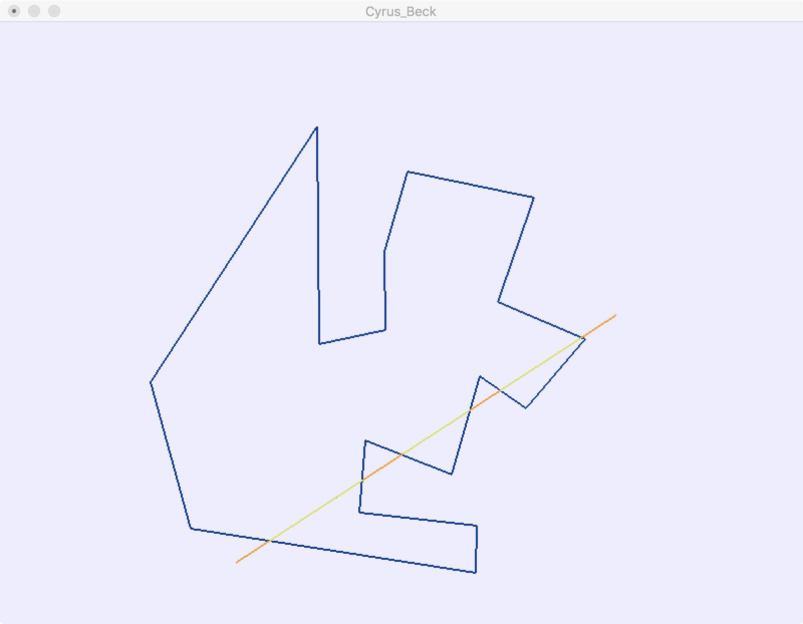
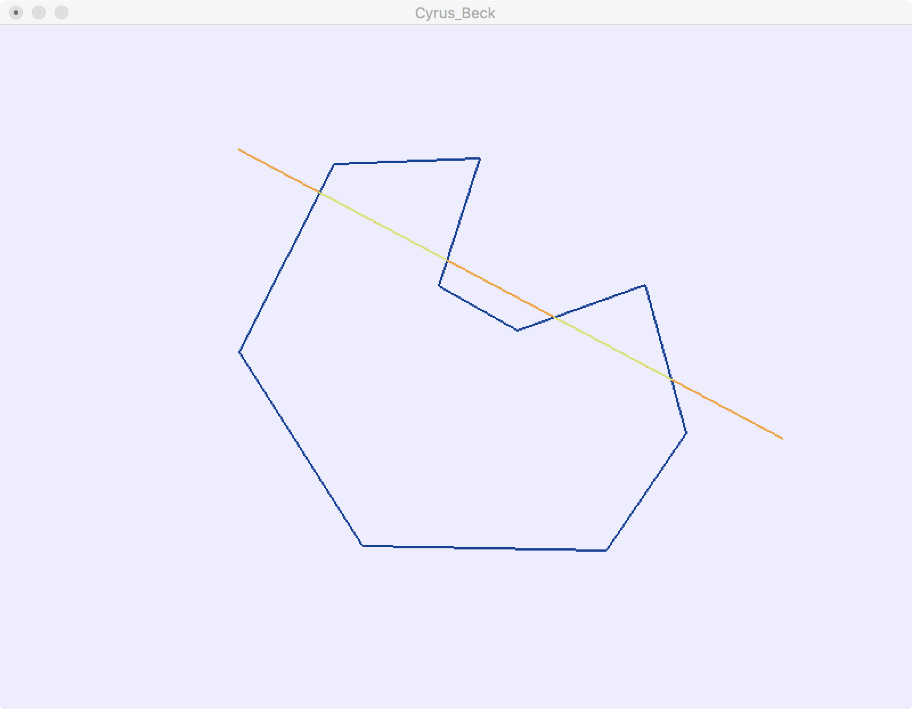
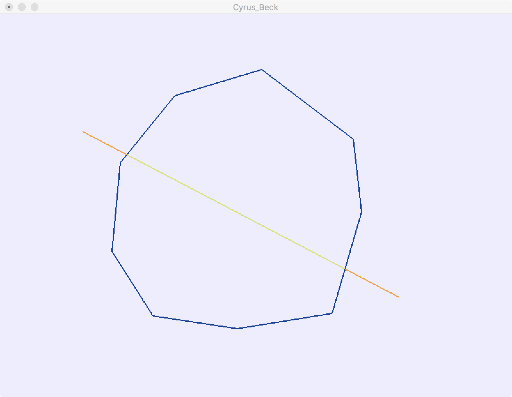
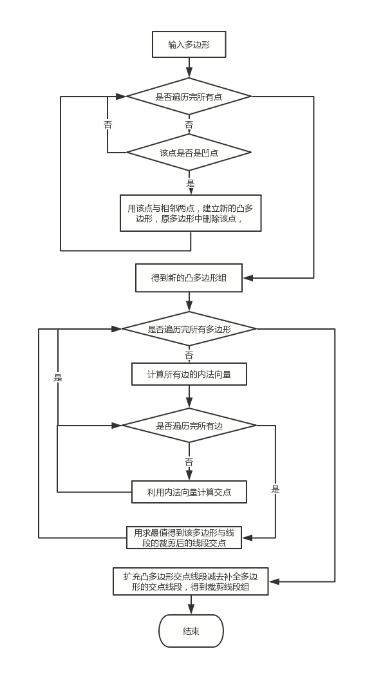

# line-clipping-with-arbitrary-polygon-window
C++ Implementaion of extended Cyrus Beck line clipping algorithm for Computer Graphics course.

Environment: MacOS OpenGL

## Run program

程序运行后，先用鼠标左键选取一系列的点，单击鼠标右键完成多边形的构建。接下来用鼠标左键选取线段的起点和终点进行裁剪。



<center>Figure 1  convex polygon window clipping result</center>

<center class="half">


</center>

<center>Figure 2  concave polygon window clipping result</center>

##  程序流程图

<center>



</center>

## 具体实现

利用OpenGL函数库和C++实现了任意多边形窗口的线段裁剪算法。代码开发环境MacOS + Xcode。

自定义数据结构类Polygon多边形，有两个成员变量Point2D数组，分别存储多边形的顶点以及法向量，还有一个成员变量_num存储边的数量。结构中的ComputeNormals()函数计算出内法向量。

```C++
struct Polygon
{
    int _num; //Num of lines, not points
    Point2D* points;
    Point2D* norms;

  	void Set(vector<Point2D> p){};	// 根据输入点数组存储和计算Polygon中的成员变量
  	void ComputeNormals(){};
}
```

主要函数ComuteLineCross()， 用来找到凹点。输入多边形的点数组p（p的首元素是x坐标值最大的点，依次按边顺序的点数组），并返回凹点在数组中的索引。

```C++
int ComputeLineCross(vector<Point2D> p) 
{
    int _num = p.size();
  	Point2D A = p[_num - 1], B = p[0], C = p[1];
  	float cross = (B._x - A._x) * (C._y - A._y) - (B._y - A._y) * (C._x - A._x);
  	bool flag = cross < 0; //	根据凸点叉乘值的正负作为凹点的评判标准
    for(int i = 1; i < _num; ++i)
    {
        int pre = i - 1 ;	// 点的前一个相邻点索引
        int next = i == _num - 1? 0 : i + 1;	// 点的后一个相邻点索引
        
        A = p[pre];
      	B = p[i];
      	C = p[next];
        
      	// 对多边形每个点的相邻边向量进行叉乘
        cross = (B._x - A._x) * (C._y - A._y) - (B._y - A._y) * (C._x - A._x);
        if((cross < 0)!= flag)	// 如果该点的叉乘值与凸点值正负不同，则该点是凹点，输出凹点索引
            return i;
    }
    return -1;
}
```

主要函数generateConvexPolygons()，用来生成补全的凸多边形组。

```C++
void generateConvexPolygons(vector<Point2D> points, vector<vector<Point2D>>& convexPolygons)
{
    int _num = points.size();
    int i = ComputeLineCross(points);
    if(i == -1)	// 根据函数返回值判断输入多边形是凸多边形还是凹多边形
        cout << "The polygen is a concave polygen." << endl;
    else
        cout << "The polygen is a convex polygen." << endl;
    
    while(i != -1)	// i不为-1时是凹点索引，循环查找原多边形里的凹点
    {	
        int pre = i - 1 < 0 ? _num - 1 : i -1;
        int next = i + 1 < _num ? i + 1 : 0;
        vector<Point2D> p{points[pre], points[i], points[next]};
        convexPolygons.push_back(p);	// 生成一个新的补全凸多边形
        points.erase(points.begin() + i);	// 在原多边形里删除该凹点
        _num --;
        i = ComputeLineCross(points);
    }
    convexPolygons.push_back(points);
}
```

主要函数Cyrus_Beck()，用每个凸多边形窗口对原线段进行剪裁。输入需要剪裁的一条线段、一个多边形以及有效线段数组，返回值为-1时代表该线段在多边形外侧，无有效线段，无需剪裁。

```C++
int Cyrus_Beck(Line2D& src, Polygon& poly)
{
    float tin = 0.0f, tout = 1.0f;
    Point2D&& vec = src.GetVector();
    
    for(int i = 0; i < poly._num; ++i)
    {
        Line2D&& line = poly.GetLine(i);
        Point2D&& norm = poly.GetNormal(i);	// 计算出法向量

        float nc = vec * norm;	// 得到内法向量与线段向量的点积
        
        if(nc == 0)
            continue;		// 点在边上
        else
        {
            float hit = (line._start - src._start) * norm / nc;	//	计算交点的参数t
            if(nc > 0)
                tout = min(tout, hit);
            else
                tin = max(tin, hit);
        }
    }

    if(tin <= tout)
    {
        Line2D dest_T;
        dest_T._start = src._start + vec * tin;
        dest_T._end = src._start + vec * tout;
        dest_V.push_back(dest_T);			// 加入每个凸多边形裁剪的线段数组
    }
    
    return tin > tout;
}
```

